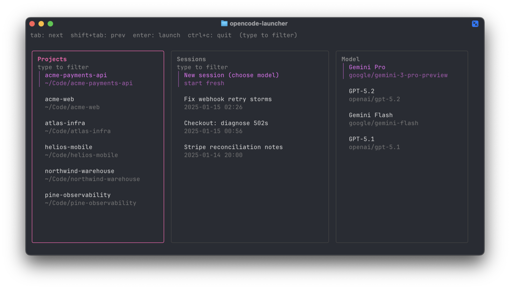

# opencode-launcher

Lightning-fast TUI launcher for OpenCode. Pick a project + model, or resume a previous session.



## Install

macOS/Linux (installs to `~/.local/bin`; re-run to upgrade):

```bash
bash -c "$(curl -fsSL https://raw.githubusercontent.com/krisvandebroek/opencode-launcher/main/install.sh)"
```

If `oc` is already taken on your system, the installer will ask for another name (or pass `--name opencode-launcher`).

Non-interactive example:

```bash
bash -c "$(curl -fsSL https://raw.githubusercontent.com/krisvandebroek/opencode-launcher/main/install.sh)" -- --name opencode-launcher
```

## Requirements

- OpenCode installed and available as `opencode` on your `PATH`
- OpenCode storage initialized (run OpenCode once so `~/.local/share/opencode` exists)

## Configure models

Create `~/.config/oc/oc-config.yaml`:

```yaml
default_model: GPT-5.2
models:
  - name: Gemini Pro
    model: google/gemini-3-pro-preview
  - name: GPT-5.2
    model: openai/gpt-5.2
  - name: Gemini Flash
    model: google/gemini-flash
  - name: GPT-5.1
    model: openai/gpt-5.1
```

Notes:
- `models` order is the order shown in the UI.
- `default_model` matches by `name` (case-insensitive). If omitted, the first model is used.

## Use

- Run `oc`
- Keybindings: `tab` / `shift+tab` switch columns; type to filter; `enter` to launch; `ctrl+c` to quit
- Useful flags: `--dry-run`, `--storage` (or `OC_STORAGE_ROOT`), `--config` (or `OC_CONFIG_PATH`)
- TUI tuning: `OC_TUI_SAFETY_SLACK=<n>` (useful in terminals that crop the rightmost border)

## How it works

- Reads local OpenCode metadata from `~/.local/share/opencode/storage/...`
- Reads your model list from `~/.config/oc/oc-config.yaml`
- Executes `opencode <projectDir> --model <provider/model> [--session <sessionId>]`
- No uploads: it only reads local files and starts `opencode`

## Screenshot/demo data

This repo includes fake OpenCode storage + config so you can take screenshots without exposing real projects.

```bash
go build -o dist/oc ./cmd/oc
OC_STORAGE_ROOT="$PWD/demo/opencode-storage" OC_CONFIG_PATH="$PWD/demo/oc-config.yaml" ./dist/oc
```

## Development

```bash
go test ./...
go build -o dist/oc ./cmd/oc
```

## License

Apache-2.0. See `LICENSE` and `NOTICE`.
